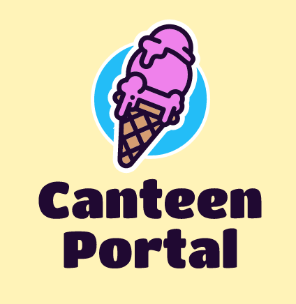

# Canteen Portal



A modern user-centric campus food stalls management system. The MERN stack based application supports the following features for various types of users:

## Customers

* To order food items from a list of available items sold by vendors
* To view, manage and edit personal profiles
* To view status of orders placed by them and pick up orders from vendors

## Vendors

* To put food items up for sale, where they can be ordered by customers
* To view, manage and edit personal profiles
* To view and manage orders placed by customers and update their status as the orders progress
* View statistics and distribution of orders placed by customers and sales completed by them
* For all food items, relevant images can be uploaded by the vendors to the database

## Features

* User authentication and authorization using JWT.
* Fuzzy search for food items
* Filtering and sorting food items based on various attributes
* Email confirmation for acceptance/rejection of orders
* Adding and removing favourite food items

## Requirements

* Node.js
* Express.js
* MongoDB
* React.js

## Setup

1. Clone the repository.

2. Change directory to the root of the repository.
```bash
cd Canteen-Portal
```

3. Fill the details in the `.env` file in backend directory.

4. Run the following command in the cloned directory:
```bash
docker-compose up -d
```
The application will now be running on http://localhost:80.

5. To stop the application, run the following command:
```bash
docker-compose down
```
